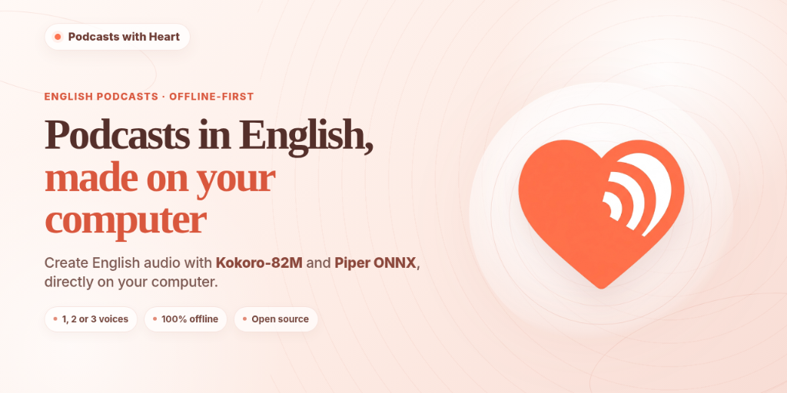

<p align="center">
  
</p>

# ❤️ Podcasts with Heart

> **Autonomous desktop podcast studio for Windows and Linux to craft 1, 2, or 3-voice educational podcasts in English, with 100% offline privacy and no duration limits.**  
> Designed for classrooms, language academies, educators, and content creators.

---

## 📥 Direct Downloads (No Python Required)

Pre-built standalone packages are provided directly in the official GitHub Releases:

### 🪟 Windows (.exe)
1. Download the standalone Windows release:  
   👉 **[Download Podcasts with Heart v1.0.0 for Windows (.zip)](https://github.com/miquelangelfuentes/podcasts-with-heart/releases/download/v1.0.0/PodcastsWithHeart-v1.0.0-Windows.zip)** (~771 MB)
2. Extract the ZIP file to any folder on your computer.
3. Run `PodcastsWithHeart.exe`.
4. Click **`📦 Models`** in the top bar to inspect installed models or download additional Piper voices in a single click.

### 🐧 Linux (Ubuntu, Debian, Fedora, Arch, Linux Mint)
1. Install system prerequisites (audio libraries and eSpeak):
   - **Debian / Ubuntu / Linux Mint**:
     ```bash
     sudo apt update && sudo apt install -y python3-tk libsndfile1 espeak-ng python3-venv
     ```
   - **Fedora**:
     ```bash
     sudo dnf install python3-tkinter libsndfile espeak-ng
     ```
   - **Arch Linux**:
     ```bash
     sudo pacman -S tk libsndfile espeak-ng
     ```
2. **One-click launch with `run_app.sh`**:
   ```bash
   git clone https://github.com/miquelangelfuentes/podcasts-with-heart.git
   cd podcasts-with-heart
   chmod +x run_app.sh
   ./run_app.sh
   ```
   *The launcher automatically configures an isolated `.venv`, verifies all audio dependencies, and opens the studio.*

3. **Or build a standalone Linux binary (`.tar.gz`)**:
   ```bash
   python3 build_linux.py
   ```
   *Generates `dist/PodcastsWithHeart-v1.0.0-Linux-x86_64.tar.gz` with zero external runtime dependencies.*

---

## 🌟 Key Features

- **Flexible Multi-Speaker Structures**:
  - **1 Voice (Monologue)**: Centered host (`pan=0%`) for instructional capsules, summaries, and audio essays.
  - **2 Voices (Dialogue)**: Dual-host peer conversations (`-25%` and `+25%`) without requiring an extra moderator.
  - **3 Voices (Roundtable)**: Centered host (`pan=0%`) with side guest panelists (`-25%` and `+25%`).
- **100% Offline & Private (School Mode)**:
  - Toggle **🏫 School Mode** with a single click in the header.
  - Automatically restricts synthesis to local **Kokoro-82M** and **Piper ONNX** models and hides cloud engines.
  - Displays the **🛡️ School Mode: 0% Internet Data (GDPR & Privacy Protected)** badge.
  - Guarantees zero text, voice samples, or student names ever leave your device.
- **Triple Voice Engines (Offline & Cloud)**:
  - **💖 Kokoro-82M Heart Engine (100% Offline, Studio Quality)**: Flagship 82M parameter neural TTS engine with 11 expressive voices (Heart, Bella, Nicole, Sarah, Sky, Adam, Michael, Emma, Isabella, George, Lewis). Zero internet required.
  - **🎙️ Piper Neural English (100% Offline)**: Lightweight (~63 MB/voice) ONNX models for US and British English (Lessac, Amy, Ryan, Alan).
  - **☁️ Microsoft Neural English (Online)**: Studio-grade cloud voices with US, UK, and Australian accents (Jenny, Guy, Aria, Davis, Sonia, Ryan, Libby, Natasha).
- **Background Music & Ambience Track**:
  - Load background soundtrack (MP3, WAV, OGG, FLAC) in continuous loop with seamless cross-fading.
  - **Intelligent Auto-Ducking**: Automatically attenuates background music (-12 dB) during vocal speech and smoothly restores full soundtrack presence during pauses and silences. Can be toggled on/off in one click.
  - Dynamic volume slider (default 15% to maintain vocal clarity) and instant live preview button (`▶ Preview` / `■ Stop`).
  - Studio-grade 1-second fade-in, 2-second fade-out, and soft peak limiter.
- **Broadcast EBU R128 Loudness Mastering**:
  - Automatic stereo spatialization (*panning*).
  - Broadcast-standard **EBU R128 loudness normalization (-16 LUFS, -1 dBTP peak)**.
  - Direct export to **160 kbps CBR Stereo MP3**.
- **Hardware Diagnostic & Compatibility Check**:
  - Built-in **`🔍 Check My System`** modal inspecting hard disk space, RAM, CPU logical cores, and GPU/ONNX Runtime acceleration.
- **Global Keyboard Accessibility**:
  - `Ctrl+G` / `Ctrl+Enter`: Generate full podcast.
  - `Ctrl+S`: Save script.
  - `Ctrl+O`: Open script.
  - `F1`: Open SSML prosody guide.
  - `Esc`: Cancel ongoing generation.

---

## 🚀 Running from Source

```bash
# 1. Clone repository
git clone https://github.com/miquelangelfuentes/podcasts-with-heart.git
cd podcasts-with-heart

# 2. Install dependencies
pip install -r requirements.txt

# 3. Launch application
python app.py
```

On Windows, you can also double-click `run_app.bat`.

---

## 📁 Project Structure

```
📁 PodcastsWithHeart/
├── 📄 app.py                     # Application entry point
├── 📁 core/                      # Audio & AI processing engines
│   ├── 📄 script_parser.py       # Podcast script parser & [VOICE_CONFIG] inspector
│   ├── 📄 text_normalizer.py     # English text, acronyms & SSML normalizer
│   ├── 📄 kokoro_engine.py       # Kokoro-82M Heart flagship engine (100% Offline)
│   ├── 📄 piper_engine.py        # Piper ONNX English engine (100% Offline)
│   ├── 📄 edge_tts_engine.py     # Microsoft Neural English engine (Online)
│   ├── 📄 audio_processor.py     # Stereo panning, loop music, EBU R128 & MP3
│   ├── 📄 voice_preview.py       # Instant preview player
│   ├── 📄 model_downloader.py    # Hugging Face model downloader
│   └── 📄 system_checker.py      # Hardware diagnostic tool (CPU, GPU, RAM, disk)
├── 📁 ui/                        # User interface (CustomTkinter)
│   ├── 📄 theme.py               # HeartTheme pastel red & warm rose palette
│   ├── 📄 main_window.py         # Main studio layout & dialogue controls
│   ├── 📄 components.py          # CleanButton & PillSelector widgets
│   ├── 📄 player_widget.py       # Audio waveform player & MP3 exporter
│   ├── 📄 components_modal.py    # Voice models manager, diagnostic & offline guide
│   └── 📄 version_check_modal.py # GitHub version checker & auto-updater
├── 📁 assets/                    # Icons, audio assets, and official banner
│   ├── 📄 banner.png             # Official repository header banner
│   ├── 📄 icon.ico / icon.png    # Application logo (Windows & Linux)
│   └── 📁 previews/              # Offline voice sample audio files
├── 📁 examples/                  # 1-voice, 2-voice, and 3-voice script templates
│   ├── 📄 sample_5min.txt        # Full 5-minute educational podcast sample
│   ├── 📄 template_1voice.txt    # 1-voice monologue template
│   ├── 📄 template_2voices.txt   # 2-voice dialogue template
│   └── 📄 template_3voices.txt   # 3-voice roundtable template
├── 📁 docs/                      # Documentation & Pedagogical Guides
│   ├── 📄 SSML_GUIDE.md          # SSML tags, pauses, speed, and pitch reference
│   ├── 📄 LLM_PROMPT_GUIDE.md    # Master prompt for ChatGPT/Claude/Gemini
│   ├── 📄 TEACHER_INFO_SHEET.md  # Pedagogical disclosure sheet for educators
│   ├── 📄 DECISIONS.md           # Architecture Decision Records (ADRs)
│   └── 📄 CREDITS.md             # Third-party attribution & model licenses
├── 📄 LICENSE                    # Official GNU AGPL v3 + CC BY-SA 4.0 license
├── 📄 evaluacion-vcer.md         # Open Educational Resource VCER Audit Report (100%)
├── 📄 build_exe.py               # PyInstaller packager for Windows (.exe / .zip)
├── 📄 build_exe.bat              # 1-click Windows compilation script
├── 📄 build_linux.py             # PyInstaller packager for Linux (.tar.gz)
├── 📄 run_app.bat                # 1-click Windows launcher
├── 📄 run_app.sh                 # Linux launcher script with auto-venv
├── 📄 requirements.txt           # Python dependencies
└── 📄 test_features.py           # Automated test suite
```

---

## 📜 License & Credits

- **Code License**: Open-source under [GNU AGPL v3](LICENSE).
- **Contents & Documentation**: [Creative Commons BY-SA 4.0](LICENSE).
- **Architecture & Technical Decisions**: See [`docs/DECISIONS.md`](docs/DECISIONS.md).
- **Third-Party Attribution**: See [`docs/CREDITS.md`](docs/CREDITS.md) for full licensing information on Kokoro-82M, Piper, and bundled libraries.

### 🤖 AI Disclosure & Human Verification

This application was created through intention-driven vibe coding with **Google Antigravity**, directed and verified by **Miquel Àngel Fuentes** under Responsible Educational Vibe Coding guidelines.

The author has personally conducted the following **rigorous human validations**:
1. **Linguistic & Lexical Verification**: Thorough review of all sample scripts, templates, and acronym expansions against native standard English phonetics.
2. **Acoustic & Audio Mastering Audit**: Critical listening audits of all 15 neural voices (Kokoro-82M and Piper) to eliminate digital clipping, calibrate seamless background music cross-fading, and guarantee compliance with the broadcast **EBU R128 (-16 LUFS)** standard.
3. **Automated Quality Testing**: Creation and verification of the test suite (`py test_features.py`) testing ONNX model integrity, stereo spatialization, and MP3 audio mastering.
4. **Offline Independence & Privacy Verification**: Empirical verification of the application running in airplane mode (zero internet connection) to ensure complete student data privacy and GDPR/FERPA compliance.

---

[Evaluación VCER de la versión 1.0: Recomendable (100 %), octubre de 2026](https://vibe-coding-educativo.github.io/vibe-responsable/vcer/?r=recomendable&p=100&f=2026-10&v=1.0&t=Podcasts%20with%20Heart&u=https%3A%2F%2Fgithub.com%2Fmiquelangelfuentes%2Fpodcasts-with-heart)

